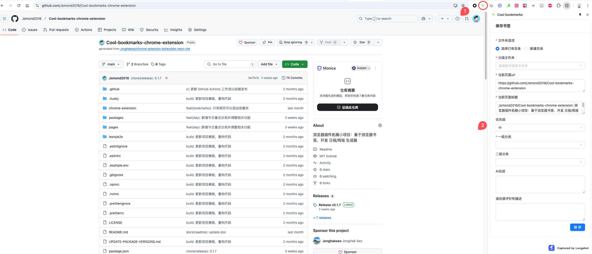
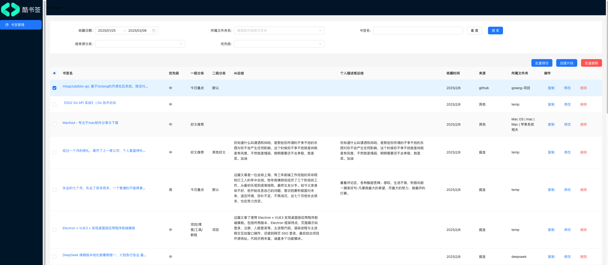

 
 # Cool-bookmarks 项目简介

 

 Cool bookmarks (酷书签) 是一个 Chrome 插件，用于快速收藏网站，标记 tag、分类、并可在书签管理列表中生成 markdown 信息。


<table>
  <tr>
    <td></td>
    <td></td>
  </tr>
</table>


## 功能特性
- 快速收藏网站：支持标记 tag 和分类。
- Markdown 信息生成：在书签管理列表中自动生成 Markdown 格式的信息。
- 日报、周报导出：方便快捷地导出为 Markdown 文件。
- [TODO] AI 总结栏：集成 AI 总结功能，帮助用户快速总结文章内容。
- 多端同步：支持书签数据持久化存储，多端同步（未来功能）。


## 安装和使用

**安装：**

- Chrome 扩展[设置为开发者模式](https://www.chromegw.com/guide/jq/1461.html)
- 下载最新的 [release zip](https://github.com/Jsmond2016/Cool-bookmarks-chrome-extension/releases) 文件，解压后直接导入到 Chrome 中即可。


**使用：**

- 收藏书签
  - 安装后，在想收藏的网页上，点击拓展的图标即可打开右侧面板，填写基础信息收藏；
- （批量）管理
  - 点击图标-选项，即可打开管理页面，对书签进行编辑(修改、编辑、删除)；
  - 复制为 markdown  格式；
  - 创建日报：筛选指定条件的书签，批量勾选，点击创建片段， 拷贝为日报；


```
我常用的基础操作流程：

- 日常收藏书签，编辑分类和备注信息；
- 创建日报时：
  - 打开管理面板，筛选指定文件夹，比如 temp；
  - 全选第一页（一般一页为一篇日报），点击创建片段，拷贝为日报；
  - 进入日报项目审核编辑

```


## 项目启动和开发

```sh
# clone by ssh
git clone git@github.com:Jsmond2016/Cool-bookmarks-chrome-extension.git
cd Cool-bookmarks-chrome-extension

# install dependencies
pnpm install

# dev
pnpm run dev


# 部署 build
pnpm run build
```

修改后，刷新 chrome 插件；


## 贡献指南

欢迎任何贡献！请先 fork 仓库并在本地创建分支进行开发。提交 PR 前，请确保代码通过所有测试。


## 常见问题（FAQ）

Q: 插件无法正常工作怎么办？ 

A: 请确保 Chrome 浏览器版本是最新的，并尝试重新加载插件。如果问题仍然存在，请提交 issue。

## 特别感谢

本项目基于 [chrome-extension-boilerplate-react-vite](https://github.com/Jonghakseo/chrome-extension-boilerplate-react-vite) v-0.3.5 搭建

感谢作者和相关开源贡献者的付出，respect~

## 许可证

本项目采用 MIT License 许可证。
 

 
   


 
